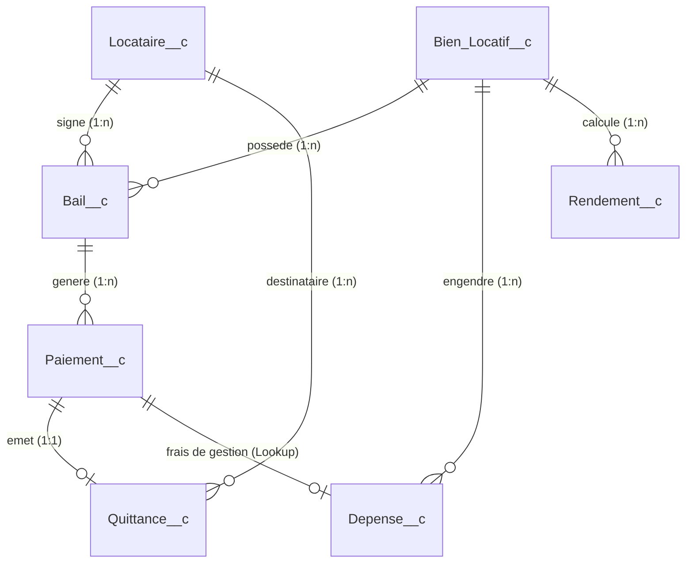
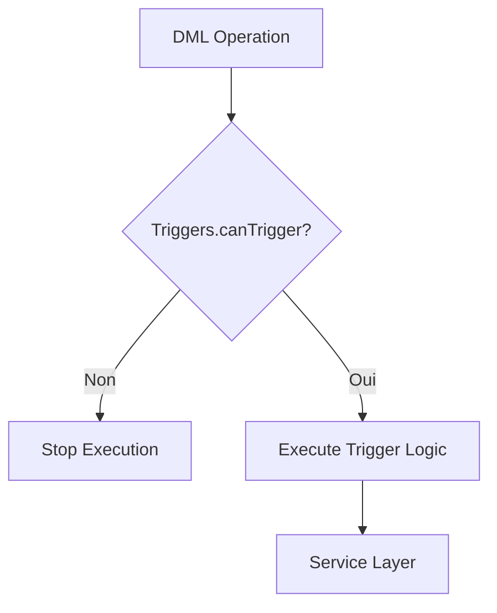

# Salesforce "Gestion Locative" - Contexte, Architecture & Guide Agent

Ce skill documente l'architecture, le modèle de données, les règles métier et les bonnes pratiques pour le projet Salesforce **Gestion Locative** (`gestion-locative-sfdc`).

---

## 1. Environnements & Configuration SFDX

- **Org par défaut** : `gestion-locative` (Username : `hbespoir2003@gmail.com`)
- **Type d'org** : Developer Edition / Scratch sans source tracking (`--no-track-source`).
- **Structure SFDX** : Format Source (`force-app/main/default`).
- **API Version** : `58.0`
- **Manifest** : `manifest/package.xml` configuré pour cibler précisément les 7 objets personnalisés, classes, triggers, LWC, pages VF, flows, actions et rapports du projet.

> [!IMPORTANT]
> **Règle pour le retrieve / deploy :** L'org ne supportant pas le source tracking direct (`sfdx pull`), utilisez toujours `sf project retrieve start --manifest manifest/package.xml` ou `sf project deploy start --manifest manifest/package.xml` (ou le skill `platform-metadata-retrieve`).

---

## 2. Modèle de Données (SObjects)

L'application repose sur **7 objets personnalisés** interconnectés :

### 1. `Bien_Locatif__c` (Biens Immobiliers)
Représente les logements, parkings ou locaux.
- **Champs clés** : `Name`, `Type__c` *(Appartement, Parking, Maison, Studio, Local Commercial)*, `Statut__c` *(Loué, Vacant, En travaux, En vente)*, `Prix_Acquisition__c`, `Date_Acquisition__c`, `Surface__c`, `Nombre_Pieces__c`, `Etage__c`, `Adresse__c`, `Code_Postal__c`, `Ville__c`, `Notes__c`.
- **Quick Action** : `clone_depenses` (déclenche le Flow pour cloner les dépenses récurrentes sur une nouvelle année).

### 2. `Locataire__c` (Locataires)
Fiche d'identité et situation des locataires.
- **Champs clés** : `Nom__c`, `Prenom__c`, `Date_Naissance__c`, `Email__c`, `Telephone__c`, `Adresse_Correspondance__c`, `Code_Postal__c`, `Ville__c`, `Situation_Professionnelle__c`, `Revenu_Mensuel__c`, `Notes__c`.

### 3. `Bail__c` (Contrats de Location)
Contrat liant un `Bien_Locatif__c` à un `Locataire__c`.
- **Champs clés** : `Bien_Locatif__c`, `Locataire__c`, `Type_Bail__c` *(Meublé, Non meublé, Commercial, Professionnel, Parking/Garage)*, `Date_Debut__c`, `Date_Fin__c`, `Date_Resiliation__c`, `Duree_Preavis__c`, `Montant_Loyer__c`, `Montant_Charges__c`, `Depot_Garantie__c`, `Jour_Paiement__c`, `Periodicite_Paiement__c`, `Indexation__c`, `Statut__c` *(Actif, En préavis, Résilié, Expiré)*, `Alerte_Fin_Bail_Envoyee__c`, `NumeroMandat__c`, `Fichier_Bail__c`.
- **Quick Action** : `Cloner_les_paiements` (déclenche le Flow pour générer les 12 échéances de l'année suivante).

### 4. `Paiement__c` (Échéances de Loyers)
Suivi mensuel des encaissements de loyers.
- **Champs clés** : `Bail__c`, `Bien_Locatif__c`, `Locataire__c`, `Mois_Concerne__c`, `Annee_Concernee__c`, `Date_Paiement__c`, `Date_Encaissement__c`, `Periode_Debut__c`, `Periode_Fin__c`, `Montant_Loyer__c`, `Montant_Charges__c`, `Montant_Total__c` *(Formule : Loyer + Charges)*, `MontantEncaisse__c`, `FraisAgence__c`, `NumeroMandat__c`, `Depense__c` *(Lookup vers Dépense liée aux frais)*, `Moyen_Paiement__c` *(Virement, Prélèvement, Chèque, Espèces)*, `Reference_Paiement__c`, `Statut__c` *(A payer, En attente, Encaissé, En retard, Impayé)*, `Statut_Icon__c` *(Badge visuel)*, `Quittance_Generee__c`.

### 5. `Depense__c` (Charges et Dépenses Immobilières)
Suivi de toutes les charges et investissements par bien.
- **Record Types** : `Autre`, `Charge_Copro`, `Credit_Immobilier`, `Credit_Immobilier_Travaux`.
- **Champs clés** : `Bien_Locatif__c`, `Nature__c`, `Date_Depense__c`, `Annee_Fiscale__c`, `Frequence__c`, `Recuperable__c`, `Description__c`, `Montant__c`, `Montant_Capital__c`, `Montant_Interets__c`, `Montant_Assurance_Pret__c`, `Montant_Charge_Copro__c`, `Montant_Fonds_Travaux_loi_Alur__c`, `Montant_Total__c`, `Statut__c`, `Statut_Icon__c`.

### 6. `Quittance__c` (Quittances de Loyer)
Documents légaux certifiant le paiement intégral d'une échéance (Loi du 6 juillet 1989 art. 21).
- **Champs clés** : `Paiement__c`, `Locataire__c`, `Date_Generation__c`, `Date_Envoi__c`, `Date_Envoi_Email__c`, `Periode_Debut__c`, `Periode_Fin__c`, `Montant_Loyer__c`, `Montant_Charges__c`, `Montant_Total__c`, `Envoyee__c`, `Envoyee_Par_Email__c`, `Statut_Envoi__c`, `Email_Destinataire__c`, `Fichier_PDF__c`.

### 7. `Rendement__c` (Performance Financière Annuelle)
Calcul agrégé du rendement brut et net par bien et par an.
- **Champs clés** : `Bien_Locatif__c`, `Annee__c`, `Total_Loyers__c`, `Total_Charges_Percues__c`, `Total_Depenses__c`, `Total_Charges__c`, `Depenses_Totales__c`, `Revenus_Totaux__c`, `Rendement_Brut__c`, `Rendement_Net__c`.

---

## 3. Architecture Apex & Déclencheurs (Triggers)

### Pattern de déclenchement
Le projet utilise une classe de contrôle des déclencheurs `Triggers.cls` pour éviter les boucles infinies de récursion :

### Services Principaux
1. **`BailService.cls`** :
   - `mettreAJourStatutBien(bienId)` : Bascule automatiquement le statut du `Bien_Locatif__c` à **"Loué"** ou **"Vacant"** en fonction des baux actifs ou en préavis.
   - `verifierFinsBail(jours)` / `envoyerAlertesFinBail(jours)` : Traitement d'alerte et envoi d'emails avant expiration de bail.
   - `resilierBail(bailId, date, preavis)` : Gestion du préavis et calcul de la date de fin.
   - `getBaux(statutFiltre)` : API exposée pour les composants LWC avec wrappers et calculs de criticité (<30 jours / <90 jours).

2. **`QuittanceService.cls`** :
   - `genererQuittance(paiementId)` : Génère la `Quittance__c` dès qu'un paiement passe au statut **"Encaissé"**.
   - `envoyerQuittanceParEmail(quittanceId, email)` : Envoi automatique du PDF de quittance au locataire.

3. **`RendementService.cls`** :
   - `calculerRendement(bienId, annee)` : Agrège les loyers (`Paiement__c`) et dépenses (`Depense__c`) par requête SOQL AggregateResult, puis upsert l'enregistrement `Rendement__c`.
   - `getRendements()` : Méthode `@AuraEnabled(cacheable=true)` pour alimenter les dashboards LWC.

4. **`ClonePaiementUtility.cls` & `CloneUtility.cls`** :
   - Méthodes `@InvocableMethod` consommées par les Flows déclaratifs pour dupliquer les échéanciers et charges d'une année $N$ vers $N+1$.

5. **`ImportDonneesHistoriques.cls` & `ImportDonneesController.cls`** :
   - Moteur d'ingestion et de parsing CSV avec création ordonnée (Biens -> Locataires -> Baux -> Paiements -> Dépenses) sous savepoints transactionnels.

6. **`UIService.cls`** :
   - Centralisation des classes CSS SLDS et codes couleur pour les statuts de paiement et baux.

---

## 4. Visualforce & Édition de Quittances PDF

- **Page Visualforce** : `QuittancePDF.page` (`renderAs="pdf"`).
- **Composant** : `QuittanceTemplate.component`.
- **Règles légales intégrées** :
  - Distinction claire Loyer nu / Provisions sur charges.
  - Mention légale obligatoire (Art. 21 de la loi n° 89-462 du 6 juillet 1989).
  - Coordonnées du bailleur (depuis `$Organization`) et du locataire.

---

## 5. Composants Lightning Web (LWC)

1. **`suiviLoyers`** : Grille dynamique des paiements avec filtres par mois/année, indicateurs de retard, boutons d'encaissement direct et génération de quittance.
2. **`rendementLocatif`** : Tableaux et indicateurs de performance locative (revenus, charges, rendement brut/net).
3. **`gestionBaux`** : Vue d'ensemble des contrats de location, alertes d'échéances et statuts.
4. **`importationDonnees`** : Assistant d'importation CSV pour initialiser le parc immobilier.

---

## 6. Guide d'Action pour les Agents IA

Lors de modifications sur ce projet :
1. **Ajout de nouveaux champs** :
   - Toujours mettre à jour le `manifest/package.xml`.
   - Vérifier si le champ impacte les calculs de `RendementService` (ex : nouveau type de dépense ou déduction) ou les conditions de `BailService`.
2. **Création / Modification de Triggers** :
   - Toujours encapsuler l'exécution avec `if (!Triggers.canTrigger('MonTrigger')) return;`.
3. **Paiements et Quittances** :
   - Ne jamais générer de quittance si le statut du paiement n'est pas `'Encaissé'`.
4. **DevOps & Git** :
   - Pousser systématiquement les métadonnées synchronisées sur la branche `master`.
