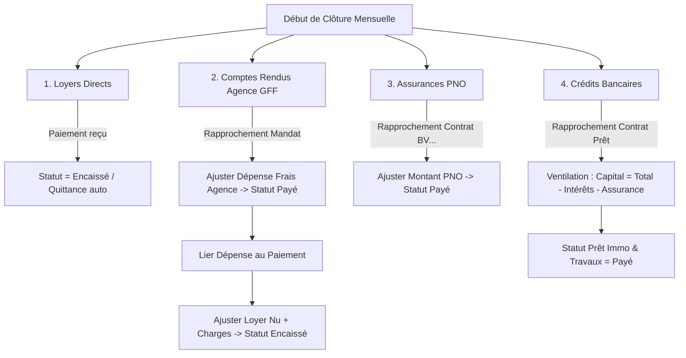
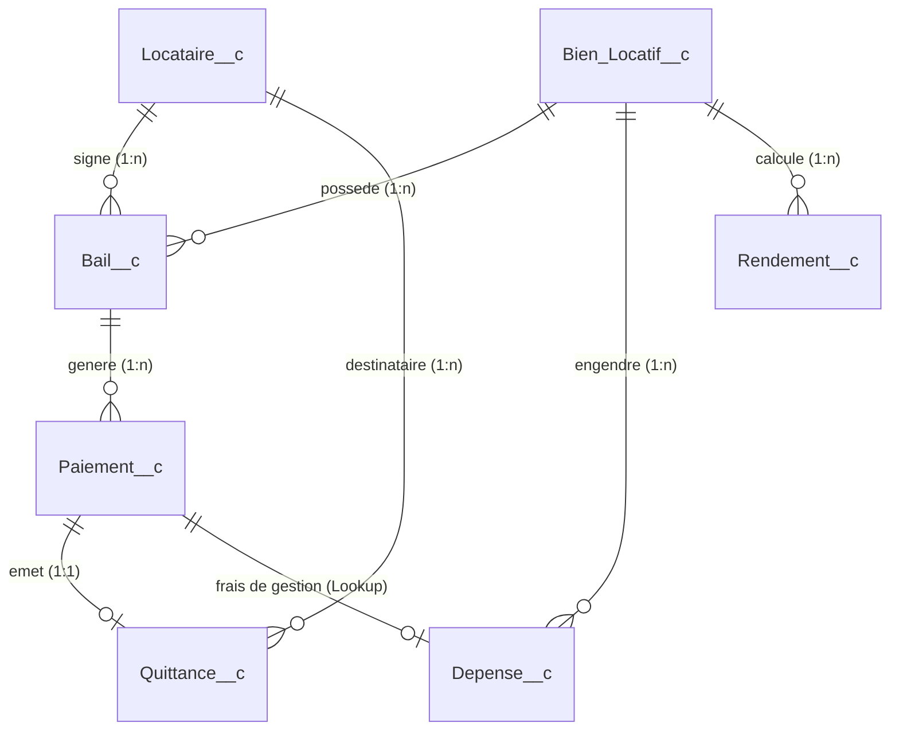

# Salesforce "Gestion Locative" - Contexte, Architecture & Guide Agent

Ce skill documente l'architecture, le modèle de données, les règles métier et la procédure mensuelle de réconciliation comptable et locative pour le projet Salesforce **Gestion Locative** (`gestion-locative-sfdc`).

---

## 1. Environnements & Configuration SFDX

- **Org par défaut** : `gestion-locative` (Username : `hbespoir2003@gmail.com`)
- **Type d'org** : Developer Edition / Scratch sans source tracking (`--no-track-source`).
- **Connecteur MCP** : `DX gestion locative` (`@salesforce/mcp@latest`) configuré sur l'org par défaut avec l'ensemble des toolsets activés (`all`).
- **Structure SFDX** : Format Source (`force-app/main/default`).
- **API Version** : `58.0`
- **Manifest** : `manifest/package.xml` configuré pour cibler précisément les 7 objets personnalisés, champs, layouts, permission sets, classes, triggers, LWC, pages VF, flows, actions et rapports du projet.

> [!IMPORTANT]
> **Règle pour le retrieve / deploy :** L'org ne supportant pas le source tracking direct (`sfdx pull`), utilisez toujours `sf project retrieve start --manifest manifest/package.xml` ou `sf project deploy start --manifest manifest/package.xml` (ou le skill `platform-metadata-retrieve`).

---

## 2. Référentiel des Biens, Contrats & Références Bancaires

Chaque bien possède ses identifiants uniques permettant l'automatisation et le rapprochement mensuel des flux bancaires et comptables :

| Bien Immobilier | Type de Gestion | Réf. Mandat Agence (`NumeroMandat__c`) | Contrat Prêt Immo (`NumeroPretImmo__c`) | Contrat Prêt Travaux (`NumeroPretTravaux__c`) | Contrat Assurance PNO (`Description__c`) |
| :--- | :--- | :---: | :---: | :---: | :---: |
| **8 rue de metz** | Mandat GFF | `22-92-371` | `10278 06086 000208129 03` | — | `BV000000006081969` |
| **12 Rue de la mélonnière** | Mandat GFF | `24-92-1047` | `10278 06086 000212875 01` | — | `BV000000006092912` |
| **125 AV Prés. G. Pompidou** | Mandat GFF | `24-92-1297` | `10278 06086 000208129 08` | — | `BV000000006010866` |
| **2 Rue henri dunant** | Mandat GFF | `25-92-1443` | `10278 06086 000212875 02` | `10278 06086 000208129 11` | `BV000000006134411` |
| **87 rue Galienni** | Direct | *Aucun* | `10278 06086 000208129 07` | — | `BV000000006002420` |
| **8 rue de metz - Parking** | Direct | *Aucun* | — | — | — |
| **2 Rue dunant - Parking** | Direct | *Aucun* | — | — | — |

---

## 3. Procédure Mensuelle de Rapprochement Opérationnel

Cette procédure doit être appliquée chaque mois lors de la réception des relevés de gestion d'agence et des extraits de compte bancaire :

### Étape 1 : Encaissement des Loyers Directs
* Pour les biens gérés en direct (ex. *87 rue Galienni*, parkings) :
  * Mettre `Statut__c = 'Encaissé'` et renseigner `Date_Encaissement__c`.
  * La `Quittance__c` PDF est automatiquement générée par le déclencheur `PaiementTrigger`.

### Étape 2 : Comptes Rendus de Gestion Agence (GFF)
* Identifier le bien grâce au `Ref. Mandat` (`Bail__r.NumeroMandat__c`).
* **Sur la Dépense d'Honoraires (`Depense__c`)** :
  * Ajuster `Montant__c` avec le total des honoraires TTC débités sur la période.
  * Mettre `Statut__c = 'Payé'` et la date d'opération.
* **Sur l'Échéance de Loyer (`Paiement__c`)** :
  * Ajuster `Montant_Loyer__c` (loyer principal nu) et `Montant_Charges__c` (provisions).
  * Lier la dépense d'honoraires via le lookup `Depense__c`.
  * Le système calcule automatiquement `FraisAgence__c` et `MontantEncaisse__c` (montant net versé au propriétaire).
  * Mettre `Statut__c = 'Encaissé'` et renseigner `Date_Encaissement__c`.

### Étape 3 : Assurances PNO (Propriétaire Non Occupant)
* Identifier la dépense correspondante grâce au N° de contrat `BV...` dans `Description__c`.
* Ajuster `Montant__c` et `Date_Depense__c` d'après l'opération bancaire.
* Mettre `Statut__c = 'Payé'`.

### Étape 4 : Crédits Immobiliers & Travaux (Crédit Mutuel)
* Identifier la dépense grâce au N° de contrat affiché dans `NumeroContratPret__c` (ou par le montant de l'échéance).
* **Pour les Crédits Immobiliers** :
  * Renseigner `Montant_Interets__c` et `Montant_Assurance_Pret__c`.
  * Calculer le capital amorti : $\text{Montant\_Capital\_\_c} = \text{Montant\_Total\_\_c} - \text{Montant\_Interets\_\_c} - \text{Montant\_Assurance\_Pret\_\_c}$.
  * Mettre `Statut__c = 'Payé'`.
* **Pour les Crédits Travaux** :
  * Passer `Statut__c = 'Payé'`.

---

## 4. Modèle de Données (SObjects)

L'application repose sur **7 objets personnalisés** interconnectés :

### 1. `Bien_Locatif__c` (Biens Immobiliers)
- **Champs clés** : `Name`, `Type__c`, `Statut__c` *(Loué, Vacant, En travaux, En vente)*, `Prix_Acquisition__c`, `Date_Acquisition__c`, `Surface__c`, `Nombre_Pieces__c`, `Etage__c`, `Adresse__c`, `Code_Postal__c`, `Ville__c`, `NumeroPretImmo__c`, `NumeroPretTravaux__c`, `Notes__c`.
- **Quick Action** : `clone_depenses`.

### 2. `Locataire__c` (Locataires)
- **Champs clés** : `Nom__c`, `Prenom__c`, `Date_Naissance__c`, `Email__c`, `Telephone__c`, `Adresse_Correspondance__c`, `Code_Postal__c`, `Ville__c`, `Situation_Professionnelle__c`, `Revenu_Mensuel__c`, `Notes__c`.

### 3. `Bail__c` (Contrats de Location)
- **Champs clés** : `Bien_Locatif__c`, `Locataire__c`, `Type_Bail__c`, `Date_Debut__c`, `Date_Fin__c`, `Date_Resiliation__c`, `Duree_Preavis__c`, `Montant_Loyer__c`, `Montant_Charges__c`, `Depot_Garantie__c`, `Jour_Paiement__c`, `Periodicite_Paiement__c`, `Statut__c`, `NumeroMandat__c`, `Fichier_Bail__c`.
- **Quick Action** : `Cloner_les_paiements`.

### 4. `Paiement__c` (Échéances de Loyers)
- **Champs clés** : `Bail__c`, `Bien_Locatif__c`, `Locataire__c`, `Mois_Concerne__c`, `Annee_Concernee__c`, `Date_Paiement__c`, `Date_Encaissement__c`, `Montant_Loyer__c`, `Montant_Charges__c`, `Montant_Total__c` *(Formule : Loyer + Charges)*, `FraisAgence__c` *(Formule : Depense__r.Montant_Total__c)*, `MontantEncaisse__c` *(Formule : Montant_Total__c - FraisAgence__c)*, `NumeroMandat__c` *(Formule : Bail__r.NumeroMandat__c)*, `Depense__c` *(Lookup vers Dépense)*, `Statut__c` *(A payer, En attente, Encaissé, En retard, Impayé)*, `Quittance_Generee__c`.

### 5. `Depense__c` (Charges et Dépenses Immobilières)
- **Record Types** : `Autre`, `Charge_Copro`, `Credit_Immobilier`, `Credit_Immobilier_Travaux`.
- **Champs clés** : `Bien_Locatif__c`, `Nature__c`, `Date_Depense__c`, `Annee_Fiscale__c`, `Description__c`, `Montant__c`, `Montant_Capital__c`, `Montant_Interets__c`, `Montant_Assurance_Pret__c`, `Montant_Charge_Copro__c`, `Montant_Fonds_Travaux_loi_Alur__c`, `Montant_Total__c` *(Formule selon Record Type)*, `NumeroContratPret__c` *(Formule dynamique tirée du bien)*, `Statut__c` *(A payer, Payé)*.

### 6. `Quittance__c` (Quittances de Loyer)
- **Champs clés** : `Paiement__c`, `Locataire__c`, `Date_Generation__c`, `Date_Envoi__c`, `Montant_Loyer__c`, `Montant_Charges__c`, `Montant_Total__c`, `Envoyee__c`, `Fichier_PDF__c`.

### 7. `Rendement__c` (Performance Financière Annuelle)
- **Champs clés** : `Bien_Locatif__c`, `Annee__c`, `Total_Loyers__c`, `Total_Charges_Percues__c`, `Total_Depenses__c`, `Revenus_Totaux__c`, `Rendement_Brut__c`, `Rendement_Net__c`.

---

## 5. Architecture Apex & Déclencheurs (Triggers)

### Pattern de déclenchement
Le projet utilise `Triggers.cls` (`canTrigger`) pour éviter toute récursion :
- **`BailTrigger` ➔ `BailService`** : Synchronise en temps réel `Bien_Locatif__c.Statut__c` (*Loué* vs *Vacant*).
- **`PaiementTrigger` ➔ `QuittanceService` & `RendementService`** : Dès qu'un paiement passe à `Encaissé`, génère le PDF et recalcule le rendement annuel du bien.
- **`DepenseTrigger` ➔ `RendementService`** : Recalcule automatiquement les rendements nets du bien dès qu'une dépense est modifiée.
- **`ClonePaiementUtility.cls` & `CloneUtility.cls`** : Méthodes `@InvocableMethod` consommées par les Flows pour cloner les échéances et charges vers l'année $N+1$.

---

## 6. Guide d'Action pour les Agents IA

1. **Rapprochement mensuel** : Se référer strictement à la section 3 et à la table des références de la section 2.
2. **Ajout de nouveaux champs** :
   - Mettre à jour le `manifest/package.xml` et le Permission Set `Gestion_Locative`.
   - Vérifier l'impact sur `RendementService`, `BailService` ou `PaiementTrigger`.
3. **Paiements et Quittances** :
   - Ne jamais forcer la création de quittance manuellement si le statut du paiement n'est pas `'Encaissé'` (le trigger s'en charge).
4. **DevOps & Git** :
   - Pousser systématiquement les métadonnées synchronisées sur la branche `master`.
