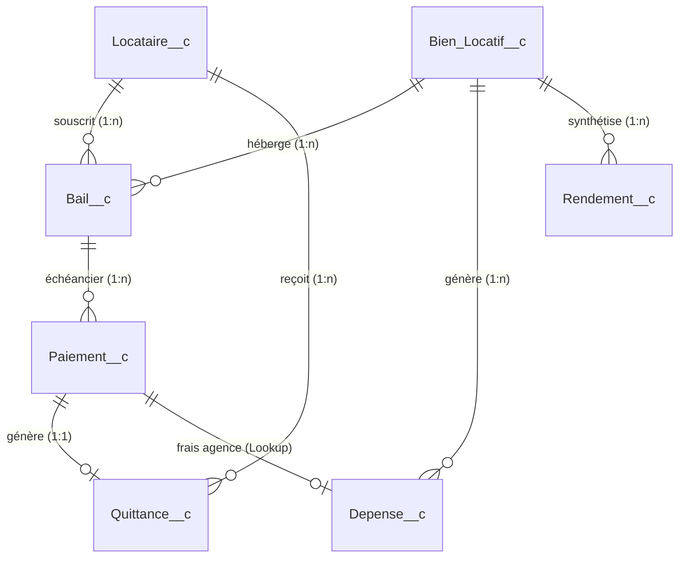
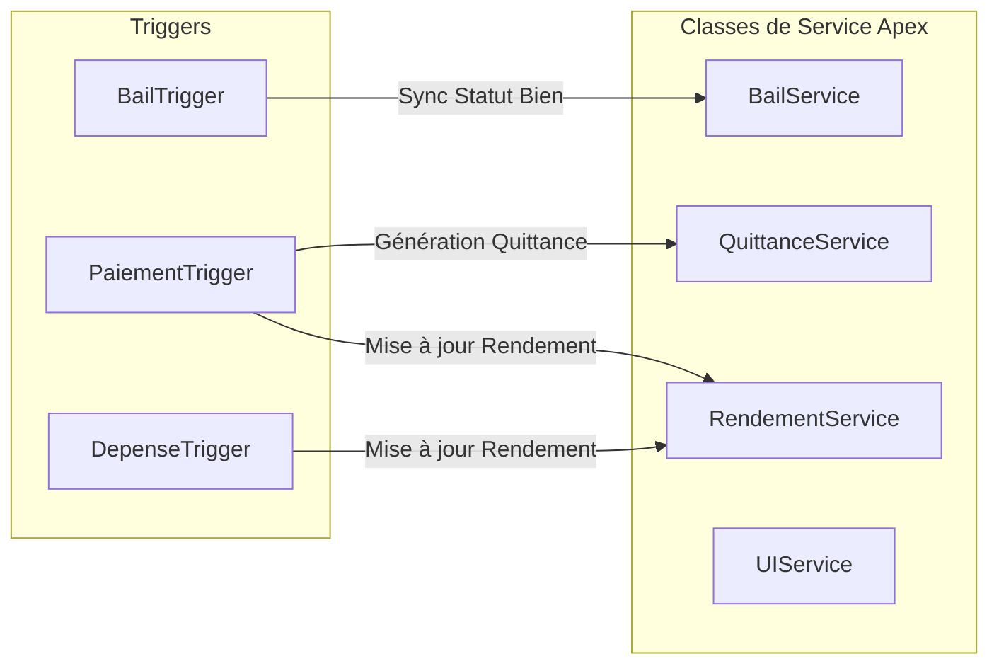

# 🏠 Application Salesforce "Gestion Locative"

[](https://developer.salesforce.com/)
[](https://developer.salesforce.com/docs)
[](https://developer.salesforce.com/docs/component-library/overview/components)
[](#)

---

## 📌 Présentation

**Gestion Locative** est une solution complète et modulaire conçue sur la plateforme **Salesforce Lightning** pour piloter un parc immobilier locatif (appartements, parkings, maisons, locaux). 

Elle offre une gestion intégrée couvrant l'ensemble du cycle de vie immobilier :
- Référencement du patrimoine immobilier et suivi des acquisitions.
- Gestion administrative des locataires et contractualisation des baux.
- Suivi rigoureux des encaissements de loyers et des charges.
- Comptabilité des dépenses d'exploitation (crédits, charges de copropriété, travaux, assurances).
- Automatisation de la facturation et génération instantanée de quittances de loyer au format PDF conformes à la loi française (Loi ALUR / Décret n° 2015-587).
- Calculs automatisés de rentabilité et de rendements locatifs bruts et nets.
- Tableaux de bord et rapports financiers individualisés par bien.

---

## 🏗️ Architecture & Modèle de Données

L'application repose sur **7 objets personnalisés principaux**, conçus avec des relations optimisées pour garantir la cohérence des calculs et la performance des requêtes SOQL.

### Diagramme Entité-Relation (ERD)



---

### 📋 Référentiel des Biens & Contrats Bancaires / Mandats

| Bien Immobilier | Mode de Gestion | Réf. Mandat (`NumeroMandat__c`) | Prêt Immobilier (`NumeroPretImmo__c`) | Prêt Travaux (`NumeroPretTravaux__c`) | Assurance PNO (`Description__c`) |
| :--- | :--- | :---: | :---: | :---: | :---: |
| **8 rue de metz** | Mandat GFF | `22-92-371` | `10278 06086 000208129 03` | — | `BV000000006081969` |
| **12 Rue de la mélonnière** | Mandat GFF | `24-92-1047` | `10278 06086 000212875 01` | — | `BV000000006092912` |
| **125 AV Prés. G. Pompidou** | Mandat GFF | `24-92-1297` | `10278 06086 000208129 08` | — | `BV000000006010866` |
| **2 Rue henri dunant** | Mandat GFF | `25-92-1443` | `10278 06086 000212875 02` | `10278 06086 000208129 11` | `BV000000006134411` |
| **87 rue Galienni** | Gestion Directe | *Aucun* | `10278 06086 000208129 07` | — | `BV000000006002420` |
| **8 rue de metz - Parking** | Gestion Directe | *Aucun* | — | — | — |
| **2 Rue dunant - Parking** | Gestion Directe | *Aucun* | — | — | — |

---

### 🔄 Guide Opérationnel : Clôture & Rapprochement Mensuel

Chaque mois, le rapprochement bancaire et comptable suit la procédure ci-dessous :

1. **Loyers Directs** :
   * Sur `Paiement__c`, passer `Statut__c = 'Encaissé'` avec la `Date_Encaissement__c`. La `Quittance__c` PDF est émise automatiquement.
2. **Comptes Rendus de Gestion Agence (GFF)** :
   * Identifier le mandat (`Bail__r.NumeroMandat__c`).
   * **Dépense Honoraires** : Ajuster `Montant__c` (= total débit honoraires TTC) et passer à **Payé**.
   * **Paiement Loyer** : Ajuster `Montant_Loyer__c` et `Montant_Charges__c`, lier `Depense__c`. Le net encaissé propriétaire (`MontantEncaisse__c`) et les frais (`FraisAgence__c`) se calculent automatiquement. Passer à **Encaissé**.
3. **Assurances PNO** :
   * Identifier la dépense via le contrat `BV...` dans `Description__c`.
   * Ajuster le montant réel prélevé et la date, passer à **Payé**.
4. **Crédits Immobiliers & Travaux (Crédit Mutuel)** :
   * Identifier la dépense grâce au N° de contrat (`NumeroContratPret__c`).
   * Renseigner `Montant_Interets__c` et `Montant_Assurance_Pret__c`.
   * Le capital amorti est calculé : $\text{Montant Capital} = \text{Total Échéance} - \text{Intérêts} - \text{Assurance}$.
   * Passer à **Payé** pour le prêt immobilier et le prêt travaux.

---

### Dictionnaire des Objets & Champs Clés

#### 1. `Bien_Locatif__c` (Biens Locatifs)
Représente les unités immobilières (appartements, parkings, garages, immeubles).
* **Champs clés** :
  * `Name` : Nom identifiant (ex: *8 rue de metz*, *125 AV Président George Pompidou*).
  * `Type__c` : Type de bien (`Appartement`, `Parking`, `Maison`, `Studio`, `Local Commercial`).
  * `Statut__c` : Statut d'occupation (`Loué`, `Vacant`, `En travaux`, `En vente`).
  * `Prix_Acquisition__c` : Prix d'achat pour le calcul de rentabilité (€).
  * `Date_Acquisition__c` : Date d'achat notariée.
  * `Surface__c` : Surface habitable (m²).
  * `Nombre_Pieces__c` : Nombre de pièces.
  * `Adresse__c`, `Code_Postal__c`, `Ville__c` : Localisation postale.
* **Actions rapides** :
  * `clone_depenses` : Déclenche le flux de duplication des dépenses annuelles récurrentes.

#### 2. `Locataire__c` (Locataires)
Stocke le profil complet et la situation des occupants.
* **Champs clés** :
  * `Nom__c`, `Prenom__c` : Identité complète.
  * `Email__c`, `Telephone__c` : Canaux de contact directs.
  * `Situation_Professionnelle__c` : Statut professionnel (`CDI`, `CDD`, `Indépendant`, `Retraité`, etc.).
  * `Revenu_Mensuel__c` : Revenus certifiés (€).
  * `Adresse_Correspondance__c`, `Code_Postal__c`, `Ville__c` : Adresse secondaire si applicable.

#### 3. `Bail__c` (Contrats de Location)
Régit les conditions contractuelles liant un locataire à un bien.
* **Champs clés** :
  * `Bien_Locatif__c` (Lookup), `Locataire__c` (Lookup) : Liaisons obligatoires.
  * `Type_Bail__c` : Régime juridique (`Meublé`, `Non meublé`, `Commercial`, `Professionnel`, `Parking/Garage`).
  * `Date_Debut__c`, `Date_Fin__c`, `Date_Resiliation__c` : Dates contractuelles.
  * `Montant_Loyer__c` : Loyer hors charges (€).
  * `Montant_Charges__c` : Provisions sur charges (€).
  * `Depot_Garantie__c` : Caution encaissée (€).
  * `Jour_Paiement__c` : Jour limite mensuel d'exigibilité (ex: 5 du mois).
  * `NumeroMandat__c` : Identifiant de mandat de gestion.
  * `Statut__c` : État du contrat (`Actif`, `En préavis`, `Résilié`, `Expiré`).
* **Actions rapides** :
  * `Cloner_les_paiements` : Déclenche le flux de génération de l'échéancier annuel.

#### 4. `Paiement__c` (Suivi des Encaissements)
Suivi mensuel des règlements locatifs.
* **Champs clés** :
  * `Bail__c`, `Bien_Locatif__c`, `Locataire__c` : Liaisons directes.
  * `Mois_Concerne__c`, `Annee_Concernee__c` : Période fiscale.
  * `Montant_Loyer__c`, `Montant_Charges__c` : Détail des sommes exigibles.
  * `Montant_Total__c` : Total exigible (Formule : Loyer + Charges).
  * `MontantEncaisse__c` : Montant effectivement perçu.
  * `FraisAgence__c` : Honoraires de gestion prélevés.
  * `NumeroMandat__c` : Mandat rattaché.
  * `Depense__c` : Lookup vers la dépense associée aux frais de gestion.
  * `Date_Paiement__c`, `Date_Encaissement__c` : Dates d'opération.
  * `Statut__c` : Statut (`A payer`, `En attente`, `Encaissé`, `En retard`, `Impayé`).
  * `Statut_Icon__c` : Indicateur visuel coloré.
  * `Quittance_Generee__c` : Indicateur d'émission de quittance.

#### 5. `Depense__c` (Dépenses & Charges d'Exploitation)
Gestion fine de toutes les sorties financières ventilées par type.
* **Record Types** :
  * `Charge_Copro` : Charges de copropriété ordinaires et fonds travaux (Loi Alur).
  * `Credit_Immobilier` : Mensualités d'emprunt (Capital + Intérêts + Assurance emprunteur).
  * `Credit_Immobilier_Travaux` : Prêts et travaux déductibles.
  * `Autre` : Taxes foncières, assurances PNO, réparations, frais de gestion.
* **Champs clés** :
  * `Bien_Locatif__c`, `Annee_Fiscale__c`, `Date_Depense__c`.
  * `Montant__c`, `Montant_Capital__c`, `Montant_Interets__c`, `Montant_Assurance_Pret__c`, `Montant_Charge_Copro__c`, `Montant_Fonds_Travaux_loi_Alur__c`.
  * `Recuperable__c` : Booléen indiquant si la charge est récupérable sur le locataire.

#### 6. `Quittance__c` (Quittances de Loyer)
Attestations légales générées après encaissement complet.
* **Champs clés** :
  * `Paiement__c`, `Locataire__c`.
  * `Periode_Debut__c`, `Periode_Fin__c`.
  * `Montant_Loyer__c`, `Montant_Charges__c`, `Montant_Total__c`.
  * `Date_Generation__c`, `Date_Envoi_Email__c`, `Statut_Envoi__c`, `Fichier_PDF__c`.

#### 7. `Rendement__c` (Rentabilité Financière)
Synthèse consolidée des performances par bien et par exercice.
* **Champs clés** :
  * `Bien_Locatif__c`, `Annee__c`.
  * `Total_Loyers__c`, `Total_Charges_Percues__c`, `Total_Depenses__c`.
  * `Rendement_Brut__c` : $\frac{\text{Total Loyers Hors Charges}}{\text{Prix d'Acquisition}} \times 100$.
  * `Rendement_Net__c` : $\frac{\text{Total Loyers} - \text{Total Dépenses}}{\text{Prix d'Acquisition}} \times 100$.

---

## ⚙️ Logique Métier & Automatisations

### 1. Triggers Apex & Architecture de Service



* **`BailTrigger` ➔ `BailService`** :
  * Met à jour en temps réel le statut du bien (`Bien_Locatif__c.Statut__c`) à **"Loué"** ou **"Vacant"** dès qu'un bail est créé, modifié, résilié ou supprimé.
  * Détecte les baux à échéance (< 30 jours, < 90 jours) pour l'envoi d'alertes par email.

* **`PaiementTrigger` ➔ `QuittanceService` & `RendementService`** :
  * Lorsque le statut d'un paiement passe à **"Encaissé"**, la quittance correspondante est automatiquement instanciée.
  * Recalcule instantanément les totaux de loyers et actualise l'enregistrement `Rendement__c` de l'année.

* **`DepenseTrigger` ➔ `RendementService`** :
  * Recalcule automatiquement le total des dépenses déductibles et le rendement net dès qu'une dépense est ajoutée ou modifiée.

---

### 2. Flux Déclaratifs (Screen Flows & Invocable Apex)

* **`Cloner_les_paiements`** :
  * Accessible via l'action rapide sur `Bail__c`.
  * Invoque `ClonePaiementUtility.clonePaiements` pour dupliquer l'échéancier complet d'une année source $N$ vers une nouvelle année cible $N+1$ avec report automatique des montants et remise du statut à *"A payer"*.

* **`clone_depenses`** :
  * Accessible via l'action rapide sur `Bien_Locatif__c`.
  * Invoque `CloneUtility.cloneDepenses` pour reconduire les charges fixes (mensualités de prêt, appels de fonds copropriété) sur le nouvel exercice fiscal.

---

### 3. Moteur d'Édition PDF (Conformité Loi ALUR)

* **Visualforce** : `QuittancePDF.page` configuré en `renderAs="pdf"`.
* **Composant** : `QuittanceTemplate.component`.
* **Fonctionnalités** :
  * Respect strict du formalisme légal (Article 21 de la loi n° 89-462 du 6 juillet 1989).
  * Ventilation distincte loyer / charges.
  * Intégration dynamique des coordonnées bailleur (`$Organization`) et locataire.
  * Envoi direct par email avec pièce jointe PDF via `QuittanceService.envoyerQuittanceParEmail`.

---

## 🖥️ Interface Utilisateur & Composants LWC

1. **`suiviLoyers`** :
   * Tableau de bord mensuel interactif avec filtre dynamique par mois et année.
   * Codes couleurs selon l'état du paiement (vert = encaissé, rouge = en retard / impayé).
   * Boutons d'action rapide : *Encaisser*, *Générer quittance*, *Envoyer par email*.

2. **`rendementLocatif`** :
   * Synthèse financière dynamique avec graphiques et tableaux de rentabilité nette/brute par bien.

3. **`gestionBaux`** :
   * Liste des baux avec badges d'alerte de fin de contrat.

4. **`importationDonnees`** :
   * Assistant guidé d'import CSV (Biens, Locataires, Baux, Historique de paiements).

---

## 📊 Rapports & Tableaux de Bord

L'application inclut des dossiers de rapports organisés par typologie :
* **Recettes Annuelles (`RecettesAnnuelles/`)** :
  * Rapports individualisés par bien : *8 rue de metz*, *2 Rue henri dunant*, *125 AV Président Georges Pompidou*, *87 rue Galienni*, *12 Rue de la mélonnière*, et parkings.
* **Dépenses Annuelles (`DpensesAnnuelles/`)** :
  * Suivi des coûts d'exploitation et charges déductibles par bien et par exercice.

---

## 🚀 Déploiement & Guide Développeur

### 1. Synchronisation avec l'organisation

L'organisation de développement par défaut étant connectée en mode sans source tracking, utilisez toujours le manifest `package.xml` :

```bash
# Récupérer l'ensemble des métadonnées depuis l'org
sf project retrieve start --manifest manifest/package.xml -o gestion-locative

# Déployer les métadonnées vers l'org
sf project deploy start --manifest manifest/package.xml -o gestion-locative
```

### 2. Exécution des tests Apex

```bash
sf apex run test --test-level RunLocalTests -o gestion-locative
```

### 3. Arborescence du Dépôt

```
gestion-locative-sfdc/
├── .agents/skills/                   # Skills IA Antigravity pour le projet
│   └── gestion-locative-context/
├── force-app/main/default/
│   ├── applications/                 # Application Lightning 'Gestion Locative'
│   ├── classes/                      # Classes de Service, Batch, Utilitaires & Tests
│   ├── components/                   # Composant Visualforce QuittanceTemplate
│   ├── flexipages/                   # Home page & Record pages Lightning
│   ├── flows/                        # Flux de clonage (Paiements, Dépenses)
│   ├── layouts/                      # Présentations de page des objets personnalisés
│   ├── lwc/                          # Composants Lightning Web (suiviLoyers, etc.)
│   ├── objects/                      # Les 7 objets personnalisés et leurs champs
│   ├── pages/                        # Page Visualforce QuittancePDF
│   ├── quickActions/                 # Actions rapides sur Bail__c et Bien_Locatif__c
│   ├── reports/                      # Rapports Recettes et Dépenses annuelles
│   ├── tabs/                         # Onglets personnalisés
│   └── triggers/                     # Déclencheurs Apex
├── manifest/
│   └── package.xml                   # Manifest complet et optimisé
└── sfdx-project.json                 # Configuration SFDX (API v58.0)
```

---

## 📜 Licence

Projet sous licence propriétaire. Développé pour la gestion patrimoniale immobilière.
